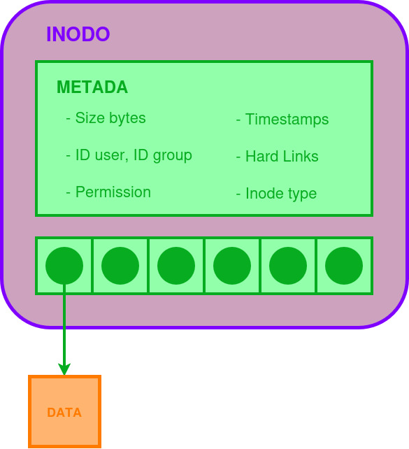
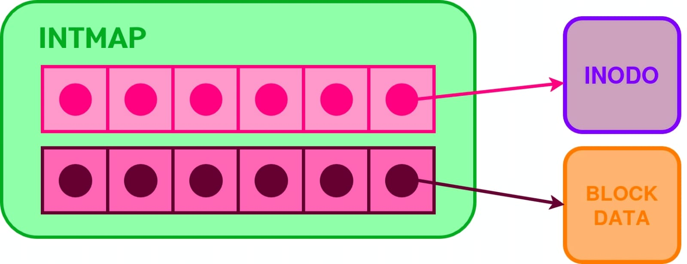
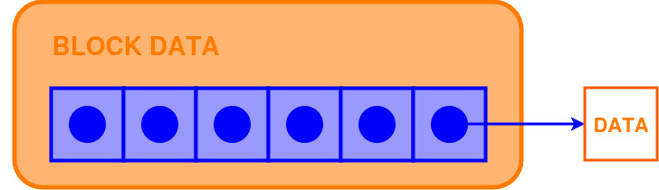
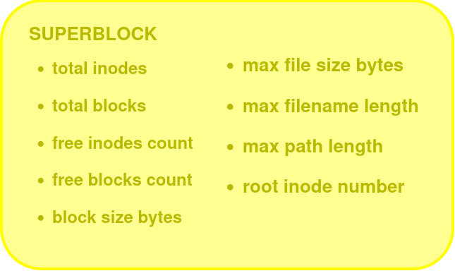
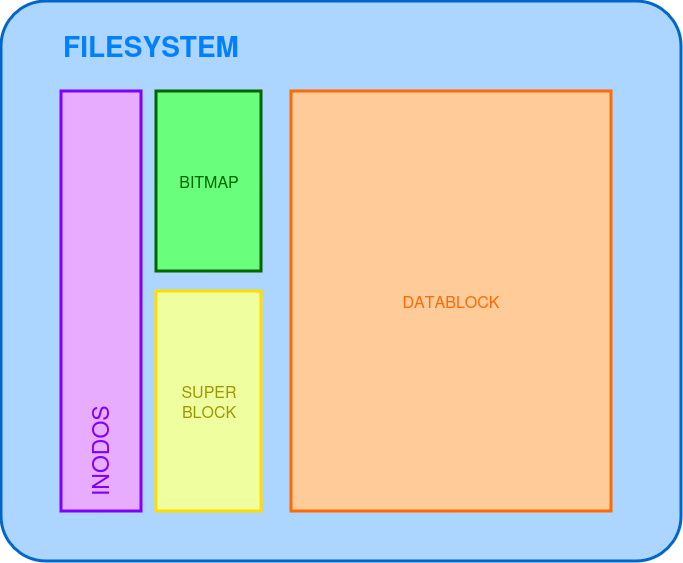

# fisop-fs

## Diseño de Filesystem

Para la representación del filesystem se decidió implementar un sistema de inodos similar al utilizado en los sistemas de archivos Unix‐like. Esto permite contar con una estructura capaz de manejar múltiples niveles de directorios y archivos.
A continuación se detallan las decisiones de diseño tomadas de cada estructura con sus respectivos diagramas.

- **Inode:**

El inodo es la estructura principal que guarda la información de un archivo o directorio en el sistema de archivos. Guarda la metadata como tamaño, usuario, grupo, permisos, fechas de acceso y modificación, cantidad de hard links y el tipo (archivo o directorio).
Además, guarda un conjunto de punteros directos a bloques donde está almacenado el contenido real.

<div align="center">

</div>

- **Intmap:**

El intmap se utiliza para llevar el control de qué inodos y bloques están libres u ocupados. Tiene dos arreglos de enteros:

- Uno para inodos
- Otro para bloques de datos

Cuando se crea o borra un archivo, el intmap se actualiza marcando la entrada correspondiente como usada o libre. Esto permite buscar rápidamente el primer inodo o bloque disponible.

<div align="center">

</div>

- **Data block:**

Los bloques de datos son en donde realmente se guarda la información de los archivos.
Cada bloque es de tamaño fijo (en nuestro caso 4096 bytes) y el contenido se almacena en estos espacios.

Los inodos apuntan a estos bloques para acceder a los datos.

<div align="center">

</div>


- **Directory:**

Un directorio es una estructura especial que contiene un arreglo de entradas. Cada una de estas representa archivos o subdirectorios.
Cuando se crea un archivo nuevo, se agrega una entrada en el directorio con su nombre y el inodo que le corresponde.

- **Superblock:**

El superblock es la estructura que resume el estado general del filesystem. Guarda datos importantes para saber cuál es el estado del sistema. Estos datos son:

- Cantidad total de inodos y bloques.
- Cuántos están libres.
- Tamaño de cada bloque.
- Longitudes máximas permitidas para nombres y rutas
- El inodo donde está la raíz


<div align="center">

</div>


- **Filesystem:**

El filesystem agrupa todas las estructuras anteriores, teniendo así un sistema inspirado en Unix-like:

- Una tabla fija de inodos.
- Un intmap (un array para inodos y otro para bloques).
- Un superblock.
- Bloques de datos.

Este no utiliza estructuras dinámicas ni reserva memoria en el heap, sino son arreglos estáticos predefinidos. Esta decisión se tomó para simplificar el manejo de memoria. 


<div align="center">

</div>

---

## Persistencia en disco

Un sistema de archivos puede vivir enteramente en RAM durante su operación. Sin embargo, en la vida real resulta indispensable persistirlo a disco al desmontarlo y poder recuperarlo al montarlo nuevamente. Para lograrlo, la estructura completa de nuestro filesystem se serializa en un único archivo en disco, de extensión `.fisopfs`.

Al montar el filesystem, se especifica un nombre de archivo con la opción `--filedisk <nombre_archivo>`. Si esto no se hace, se elige un nombre por defecto: `persistence_file.fisopfs`.

Para soportar la ejecución en background, se construye el path absoluto del archivo de pesistencia utilizando `getcwd`.

El montaje se realiza cuando se llama a la función `fisops_init` (en `fisopfs.c`). La información contenida en el archivo se lee de disco a memoria y, una vez deserializado el sistema, la operación continúa exclusivamente en memoria.

Si no existe un archivo de persistencia con el nombre elegido, si se encuentra vacío o si se produce algún error de apertura/lectura, se inicializa un nuevo sistema de archivos.

Cuando se desmonta el filesystem, se llama a `fisops_destroy` y la información se persiste nuevamente en disco, escribiendo en el archivo la información guardada en memoria. Para escribir el archivo, el mismo se abre en modo `wb`, lo cual permite crearlo en caso de que no existiera al hacer el montaje y se haya iniciado un nuevo sistema.

De esta forma, a través de múltiples ejecuciones, los datos persistirán.

---

## Búsqueda de archivos dado un path

Un sistema de archivos debe ser capaz de soportar distintas operaciones para cumplir con su propósito de proveer datos persistentes con un nombre para permitir a los usuarios organizarlos durante un tiempo prolongado. Se vuelve necesario entonces poder encontrar archivos dado un path. Para ello, nuestro filesystem utiliza la función **`fs_resolve_path`** del archivo `filesystem.c` en el directorio `src`.

La función mencionada recibe por parámetro la ruta del archivo a buscar y devuelve el número de inodo que contiene su respectiva metadata.

En primer lugar se realiza un chequeo para saber si el path corresponde al directorio raíz; en caso afirmativo, se devuelve su número de inodo almacenado en el superbloque.

```c
if (strcmp(path, NAME_ROOT) == 0) {
  return fs->superblock.root_inode_number;
}
```

Si el path no corresponde al root, se empieza a recorrer el string, separándolo en partes mediante el delimitador `/` para buscar por directorios. Para esto se utiliza `strtok` sobre una copia del string. También se tienen 2 variables que se irán actualizando constantemente a medida que se vaya recorriendo: `current_inode_number` y `current_inode`, los cuales en un principio referirán al inodo del root.

```c
// Copia del path
char aux_path[MAX_PATH_LEN];
strncpy(aux_path, path, MAX_PATH_LEN);
aux_path[MAX_PATH_LEN - 1] = '\0';
// Variables para almacenar el inodo actual y su correspondiente número
uint32_t current_inode_number = fs->superblock.root_inode_number;
inode_t *current_inode = &fs->inodes[current_inode_number];
```

A continuación, se ejecuta un bucle `while` en el cual se obtiene el directorio actual a partir de su inodo con la función `get_directory_by_inode`. Una vez conseguido, se busca dentro de su contenido una entrada cuyo nombre corresponda al del siguiente componente del path, empleando para ello `directory_lookup`.

```c
char *token = strtok(aux_path, "/");
while (token) {
  directory_t *current_dir = get_directory_by_inode(fs, current_inode);
  if (!current_dir) {
    return -1; 
  }

  current_inode_number = directory_lookup(current_dir, token);
  if (current_inode_number == -1) {
    return -1;
  }
```

Luego, se actualiza la variable que contiene al inodo actual accediendo al arreglo de inodos del filesystem mediante su número ya obtenido y se vuelve a ejecutar `strtok` para iterar sobre el nuevo tóken.

```c
  current_inode = &fs->inodes[current_inode_number];
  inode_update_atime(current_inode);
  token = strtok(NULL, "/");
}
```

El bucle finalizará cuando `strtok` devuelva `NULL`, es decir, cuando ya no se encuentren más delimitadores `/`, señal de que se terminó de recorrer la ruta y, por lo tanto, los últimos valores de `current_inode` y `current_inode_number` corresponderán al del archivo (o directorio) deseado.

Al finalizar la ejecución de `fs_resolve_path`, la función que la invoca podrá obtener el inodo asociado al archivo en cuestión. De este modo, el filesystem podrá acceder no sólo a su metadata, sino también a los bloques de datos.

```c
int inode_num = fs_resolve_path(fs, path);
inode_t *inode = &fs->inodes[inode_num];

for (int i = 0; i < NUM_DIRECT_BLOCKS; i++) {
  int blk = inode_get_direct_block(inode, i);
  fs->data_block[blk].data;
  // operaciones ...
}
```

---

## Salida de tests

```sh
$ ./test.sh 
Eliminando archivo de persistencia previo para iniciar un nuevo File System...
Montando File System...

[0] Creación de archivo (touch)
✔ Archivo creado
archivo1
✔ Archivo aparece en ls

[2] Escritura y lectura (echo/cat)
✔ Lectura OK

[3] Escritura binaria
-rw-rw-r-- 1 melina melina 100 dic 31 02:26 ./mnt/binario
✔ Archivo binario creado

[4] Append (echo >>)
segunda linea
✔ Append OK

[5] Truncado (>)
✔ Truncado OK

[6] Borrado de archivo (rm)
✔ Archivo borrado

[7] Creación de directorio y subdirectorio
✔ Subdirectorio creado

[8] Lectura de directorio (ls)
..
✔ Pseudo-directorio .. OK
.
..
✔ Pseudo-directorio . OK

[10] Borrado de subdirectorio vacío
✔ Subdirectorio borrado

[11] Borrado de directorio vacío
✔ Directorio borrado

[12] Estadísticas (stat)
  Fichero: ./mnt/archivo2
  Tamaño: 0         	Bloques: 0          Bloque E/S: 4096   fichero regular vacío
Dispositivo: 32h/50d	Nodo-i: 6           Enlaces: 1
Acceso: (0664/-rw-rw-r--)  Uid: ( 1000/  melina)   Gid: ( 1000/  melina)
Acceso: 2025-12-31 02:26:17.000000000 -0300
Modificación: 2025-12-31 02:26:17.000000000 -0300
      Cambio: 2025-12-31 02:26:17.000000000 -0300
    Creación: -
✔ stat ejecutado

[13] Permisos y propietario
-rw-rw-r-- 1 melina melina 0 dic 31 02:26 ./mnt/archivo2
✔ ls -l ejecutado

[14] Error al borrar directorio no vacío
✔ No permite borrar directorio no vacío

[15] Desmontado del File System
✔ File System desmontado correctamente

[16] Creación de archivo de persistencia
✔ Archivo de persistencia creado - persistence_file.fisopfs

[17] Persistencia en disco
✔ Archivos persistidos correctamente
✔ Subdirectorio persistido correctamente
✔ Archivo de subdirectorio con contenido persistido correctamente


------------ CHALLENGES ------------

[20] Symlink
l------rwx 1 melina melina    16 dic 31 02:26 link_symlink -> original_symlink
✔ Symlink creado y listado
✔ Lectura a través de symlink correcta

[22] Hard link
✔ Ambos hard links existen
✔ Contenido idéntico en hard links
✔ Archivo sigue vivo con otro hard link
✔ Borrado real al eliminar último hard link

[26] Directorios anidados: más de dos niveles
✔ Directorios anidados creados (4 niveles)

[27] Cota máxima de niveles
✔ Se respeta cota máxima de niveles de directorios

[28] Cota máxima de longitud de path
✔ Path demasiado largo rechazado

[29] chmod
✔ No se puede leer archivo sin permisos
✔ Se puede leer después de chmod 644

[31] chown
✔ chown ejecutado sin error


File System desmontado.


========================================
RESUMEN DE TESTS
Exitosos: 32
Fallidos: 0
Total: 32
========================================
```