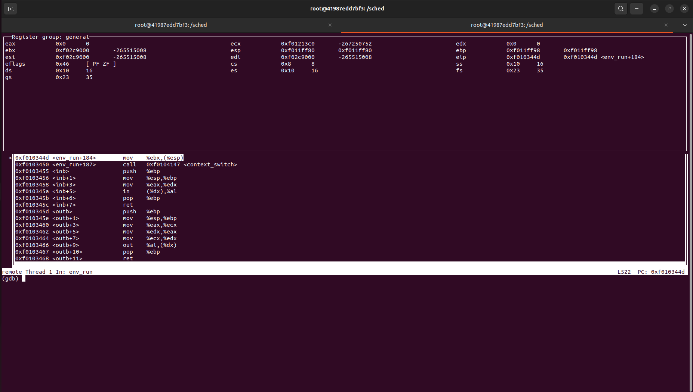
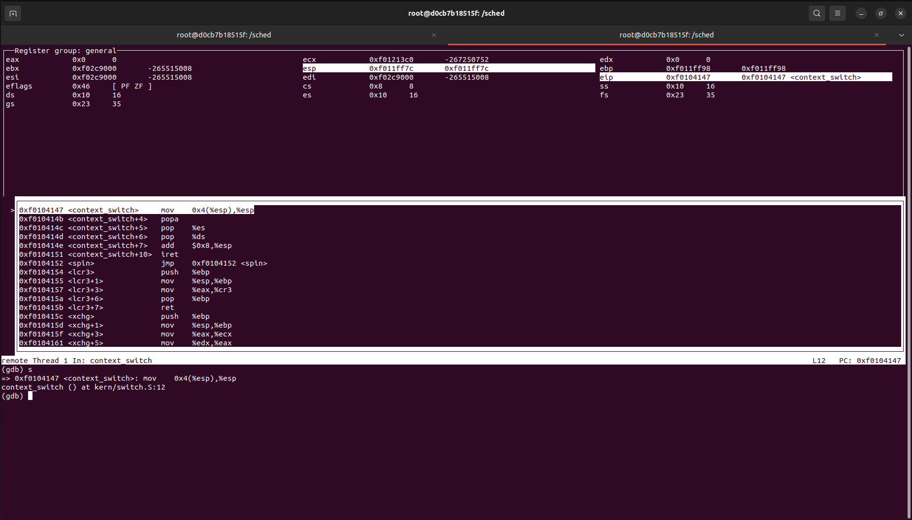
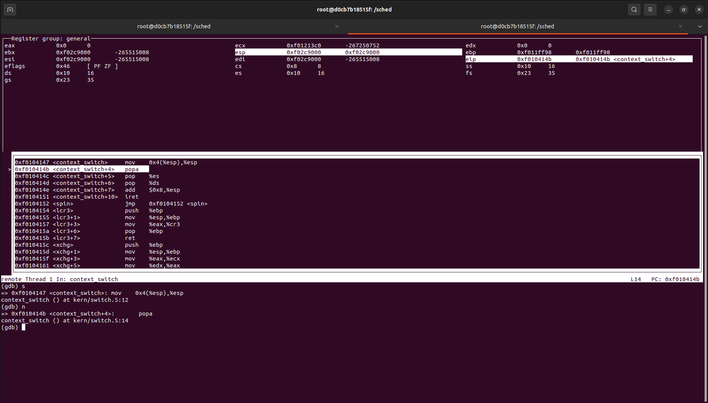
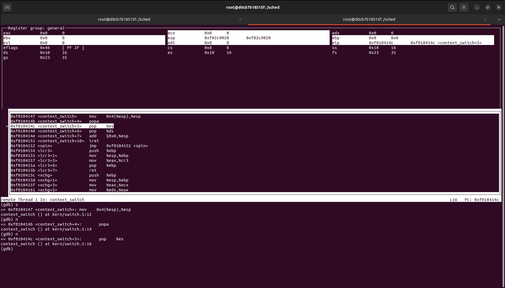
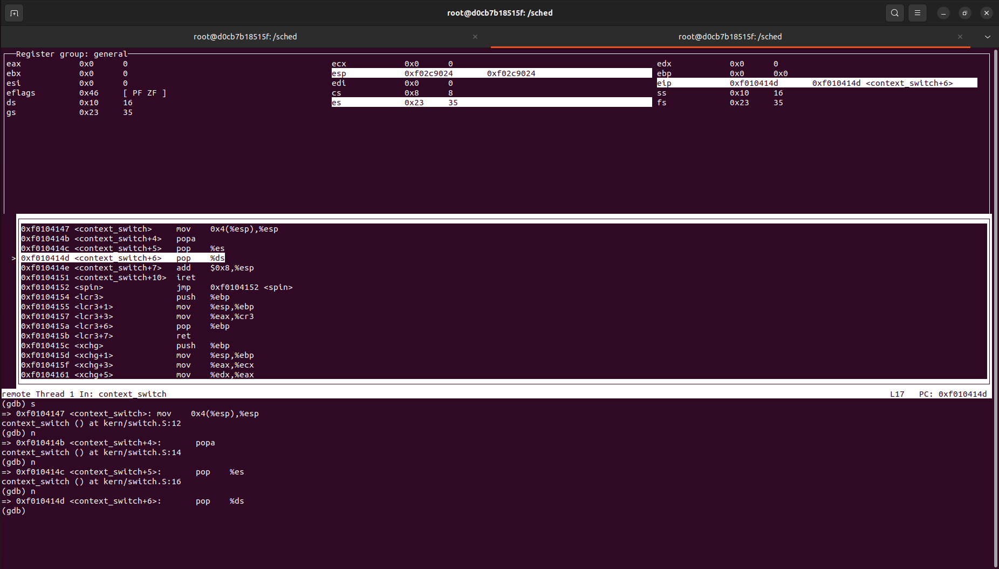
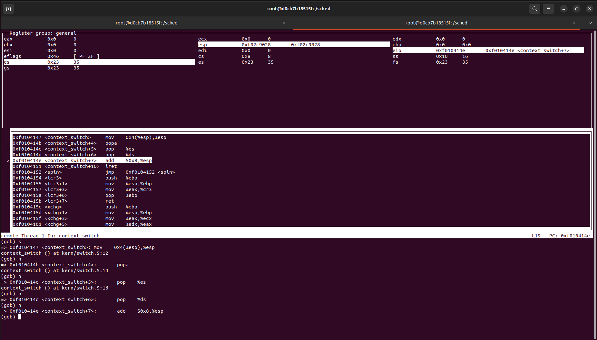
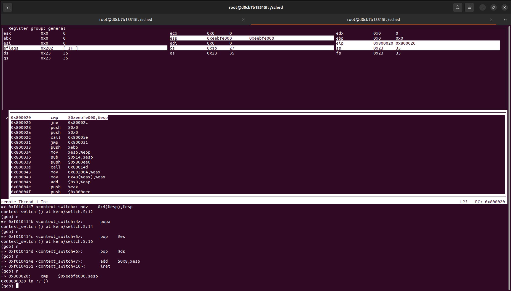
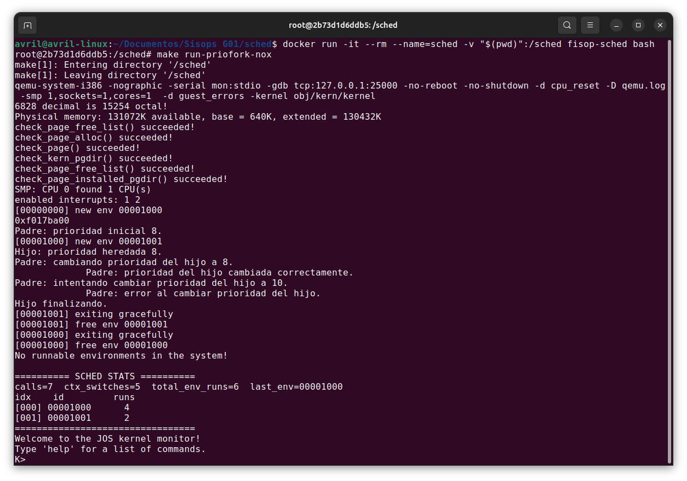

# SCHED

## Cambio de contexto

### De modo kernel a modo usuario

Un **cambio de contexto** implica congelar el estado del CPU y reemplazarlo por otro. Cuando se decide realizar un cambio de contexto, se invoca al scheduler, quien elige el siguiente proceso a ejecutar y llama a `switch`. Esta función se encarga de guardar el estado del kernel-space y del user-space, y restaura el proceso
candidato. Una vez ocurrido esto, se regresa al user-space. De esta manera, se efectúa el cambio de contexto de modo Kernel a modo usuario.

En este apartado es posible visualizar, mediante el uso de la herramienta `GDB`, este cambio de contexto, realizando un seguimiento detallado de las instrucciones llevadas a cabo por la función `context_switch`.

En esta imagen se muestra el estado del stack previo a la llamada de `context_switch`, es decir, en `env_run` (función caller).

<p align="center">

</p>

Las siguientes fotos reflejan los cambios ocurridos en el stack a medida que se van ejecutando las instrucciones que conforman el `context_switch`.

En primer lugar, se realiza `mov 4(%esp), %esp` para hacer que el stack pointer apunte al Trapframe, estructura que almacena los registros a restaurar.

<p align="center">

</p>

En este paso, al hacer `popal` se restauran todos los registros de propósito general: comparando las próximas 2 imágenes, es posible observar cómo cambian las direcciones en memoria de los mencionados registros.

<p align="center">

</p>

En los próximos 2 pasos se restauran los registros `es` y `ds`.

<p align="center">

</p>

<p align="center">

</p>

En este punto, los únicos registros que faltan restaurar son `eip`, `cs`, los `eflags` y `ss`, para lo cual se utiliza la instrucción especial `iret`. Sin embargo, debemos tener en cuenta que actualmente nuestro stack pointer apunta a la dirección de memoria que almacena el campo `tf_trapno` del Trapframe. Por lo tanto, antes de ejecutar `iret` se realiza `add $8, %esp`: movemos el stack pointer 8 bytes para "omitir" los campos del struct referidos a errores (`tf_trapno` y `tf_err`). Así, `esp` ya está apuntando a la dirección de memoria adecuada para ejecutar `iret`.

<p align="center">

</p>

<p align="center">

</p>

Una vez ejecutado `iret`, finaliza el cambio de contexto. En la imagen presentada a continuación se observa el comportamiento de los registros luego de su ejecución.

<p align="center">

</p>

## Scheduler con prioridades
La política de scheduling **Round Robin** consiste en asignar a todos los procesos la misma proporción de tiempo de uso del CPU (time slice). Transcurrido este período, se pasa a otro proceso, y así sucesivamente.

En `sched.c` se realiza una implementación sencilla de Round Robin. La misma se encarga de buscar, entre todos los procesos, uno que esté en estado RUNNABLE (es decir, está listo para ser ejecutado pero aún no lo está siendo ya que otro proceso está haciendo uso del CPU). Si se encuentra un proceso en este estado, se lo guarda como el siguiente a ser ejecutado y se llama a la función `env_run`. Caso contrario, se asigna como próximo proceso el actual, en caso de que el mismo esté en estado RUNNING.

Si bien la política Round Robin es justa, no tiene en consideración el hecho de que no todos los procesos son iguales: algunos son más importantes o bien requieren de un mayor uso del CPU respecto a otros. En consecuencia, esta política puede no ser suficiente para situaciones más reales. Es por este motivo que se decidió implementar un **scheduler con prioridades** basado en la política **MLFQ (Multi-Level Feedback Queue)**.

Para ello, se incorporó un nuevo campo de prioridad en la estructura `Env`, ubicada en `sched/inc/env.h`, de modo que cada proceso pueda mantener su propia prioridad. Este campo se inicializa al momento de la creación del environment (`env`) con la prioridad máxima, tal como lo establecen las reglas del scheduler MLFQ.

Dado que un proceso no debe monopolizar la CPU, se definió un tiempo límite de ejecución llamado `QUANTUM_LIMIT`.
Si un proceso excede dicho límite, su prioridad se reduce en una unidad, exceptuando aquellos que ya se encuentran en el nivel de prioridad más bajo (1).

Al momento de seleccionar el próximo proceso a ejecutar, el scheduler elige aquel con mayor prioridad. En caso de que varios procesos compartan la misma prioridad, la selección se realiza utilizando la política round-robin.

Pasado un tiempo definido como `AGING_INTERVAL`, se le sube una prioridad a todos los enviroments. Por ejemplo si tiene 5, pasará a tener 6 de prioridad, así con cada uno de los procesos.

Cabe mencionar que si un proceso llama a `fork()`, el scheduler le asignará la misma prioridad que tuvo en ese momento el padre. 

Toda la lógica correspondiente a esta implementación se encuentra en el archivo `sched/kern/sched.c` en la función `sched_yield()`, dentro de la sección `SCHED_PRIORITIES`.


### Adición de syscalls

Se añadieron dos syscalls en el `sched/inc/lib.h` para uso del usuario, las cuales son:

```C
int sys_getpriority(envid_t envid);
//obtiene la prioridad de un entorno

int sys_setpriority(envid_t envid, int priority);
//establece una nueva prioridad en el entorno
```

Para esta integración fue necesario incluir ambas funciones en la enumeración de system calls del kernel, definida en `sched/inc/syscall.h`.
De esta forma, el kernel puede reconocerlas y asignarles un identificador único dentro de la tabla de llamadas al sistema.

Cada una de estas system calls fue implementada en los siguientes archivos:

- En `sched/lib/syscall.c`, definimos la interfaz de usuario, donde cada función invoca a `syscall()` pasando el número de llamada correspondiente junto con sus parámetros.

- En `sched/kern/syscall.c`, se desarrolla la lógica del lado del kernel, donde la función `syscall()` manda la ejecución hacia la rutina apropiada (`sys_getpriority`, `sys_setpriority` u otra syscall), según el identificador recibido.

## Estadísticas

Las estadísticas son mostradas por el kernel al finalizar la ejecución de todos los procesos.

### Historial de procesos ejecutados/seleccionados

Se implementó un historial que guarda una traza cronológica de las decisiones que hizo el scheduler, registrando:

- Indice de mayor a menor, siento el menor el primer ejecutado hasta el último.
- El identificador del proceso (id).
- La cantidad de veces que se ejecutó en la CPU.
- La prioridad del proceso (si aplica).

El registro del evento se realiza justo antes de cada llamada a `env_run` dentro de `sched_yield()`.
Además, se guarda el `env_id` completo (incluyendo la generación) para evitar confusiones en caso de reutilización `ENVX`.

### Número de llamadas al scheduler

Se lleva un conteo de todas las veces que se invoca `sched_yield()`, incluso si no se produce un cambio de proceso.
Esto se implementa con un simple incremento en la primera línea de la función:
    ```c
    n_sched_calls++;
    ```

De esta forma, el contador refleja cuántas veces el sistema intentó planificar, no solo los casos donde hubo cambio efectivo.

### Número de ejecuciones por cada proceso

También se mide cuántas veces cada entorno fue efectivamente ejectutado.
La actualización se hace justo antes de ejecutar el entorno, osea antes de `env_run(env)`:

  ```c
  runs_per_env[ENVX(env->env_id)]++;
  ```

#### Puntos de actualización de las Estadisticas dentro de `sched_yield()`

- Entrada a `sched_yield()`

 `n_sched_calls++` (una sola vez, al inicio).

- En cada parte que termina en `env_run(next)`

  `n_context_switches++` si el nuevo entorno es distindo al anterior.

  Actualizamos el `last_env_run` con el nuevo id del entorno.

  Incrementamos `runs_per_env[ENVX(next->env_id)]++` (o `next->runs_total++`).


#### Salida / Reporte de estadísticas

Las estadísticas se imprimen al entrar a `sched_halt()` con cero entornos `ENV_RUNNABLE` (caso natural de depuración del lab). En ese momento se muestra un resumen general del scheduler:

    - Total de llamadas al scheduler `n_sched_calls`


    - Total de context switches `n_context_switches`

Y una tabla que contiene los entornos ejecutados con su información resumida:

  - `env_id`
  - `status`
  - `priority` (si aplica)

Como resultado de las ejecuciones obtuvimos en la siguientes imagenes lo siguiente:

- Aqui se muestra como un proceso no puede modificar su prioridad a una superior, como dijimos al principio, un proceso no puede monopolizar el CPU. Sin embargo, sí puede minimizar su propia prioridad.

<p align="center">

</p>

- Acá observamos como la prioridad del hijo se hereda del padre. Además, como sabemos que el padre siempre debe esperar a que termine el hijo, el padre vendría a ser el último proceso en ejecutarse. Eso podemos verificarlo exitosamente en las estadísticas. 

<p align="center">

</p>

En ambas imágenes, independientemente de los procesos ejecutados, al final siempre se imprimen las estadísticas del scheduler y el historial de procesos.
